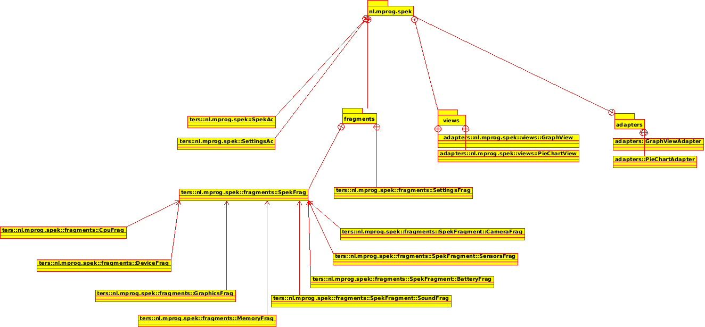

#Design Doc

##Index
+ Model Class Diagram
+ Style Guide & Code Practices

## Model class diagram

Our app hierachy will look something like this:

For the original UML file see [here](design/classdiagram.xmi).

##Style Guide & Code Practices

All of our app will be written in Java, by which we will be adherring to the 
[Google Java Styleguide](https://google.github.io/styleguide/javaguide.html) unless otherwise specified.

For our project structure and coding practices we'll try to follow 
[futurice's "Best Practices"](https://github.com/futurice/android-best-practices) as closely as possible,
without going against what we've learned for Native App Studio, breaking compatability, or creating unnecessary extra work.

- - -
Joost Bremmer < [toost.b@gmail.com](mailto:toost.b@gmail.com) >